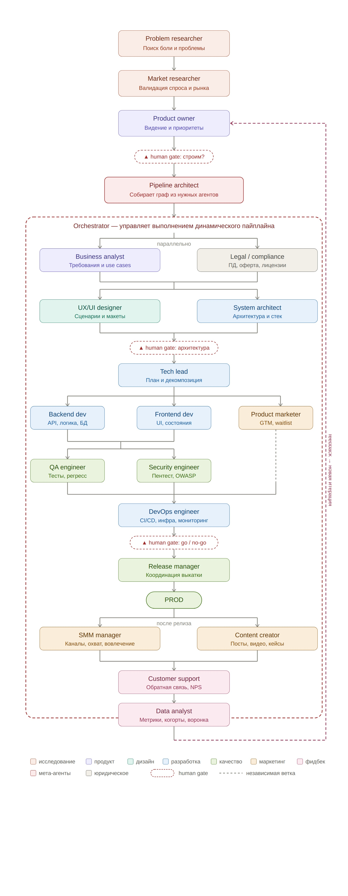

# Product Development Pipeline

[🇷🇺 Русская версия](README.md)

A full-cycle AI-powered product development pipeline — from idea to production and back. Each stage is handled by a specialized AI agent, while humans make decisions at key checkpoints.



## How It Works

**Product Development Pipeline** is a framework where AI agents work as a development team. You describe a product idea, and the system:

1. Researches the problem and market
2. Shapes product vision and business analysis
3. Checks legal and compliance requirements
4. Designs UX/UI
5. Creates architecture, writes code, sets up infrastructure
6. Tests and verifies security
7. Ships a release
8. Launches marketing
9. Collects feedback and analytics

Each agent is a Claude Code sub-agent with its own system prompt, rules, and skills. Agents pass artifacts to each other through a DAG dependency graph.

### Core Principles

- **Project chat** — via the dashboard, using your Anthropic API key
- **Agent execution** — via [Claude Code](https://docs.anthropic.com/en/docs/claude-code) CLI (`claude --print`)
- **Artifacts** — each agent writes files to `projects/{project_id}/{phase}/{agent}/`
- **State** — stored as JSON (`orchestrator/state/{project_id}.json`)
- **Gate checkpoints** — humans make go/stop/pivot decisions via the dashboard

### Gate Checkpoints (Human-in-the-Loop)

| Gate | When | Decisions |
|------|------|-----------|
| **Gate 1: Build?** | After Product Owner, before Pipeline Architect | go / pivot / stop |
| **Gate 2: Architecture** | After System Architect + UX/UI Designer, before Tech Lead | go / revise / stop |
| **Gate 3: Go/No-go** | After QA + Security + DevOps, before Release Manager | go / no-go / rollback |

## Quick Start

### Requirements

- [Claude Code](https://docs.anthropic.com/en/docs/claude-code) CLI installed and authenticated
- Node.js 20+
- Python 3.10+
- Anthropic API key (for dashboard chat)

### Installation

```bash
# 1. Clone the repository
git clone https://github.com/mogilevtsevdmitry/product-development-pipeline.git
cd product-development-pipeline

# 2. Set up environment variables
cp orchestrator/.env.example orchestrator/.env
cp dashboard/.env.example dashboard/.env.local
# Edit the files and add your API keys

# 3. Install dashboard dependencies
cd dashboard
npm install
cd ..

# 4. Start the dashboard
cd dashboard
npm run dev
```

The dashboard will be available at http://localhost:3344

### Creating Your First Project

1. Open the dashboard in your browser
2. Click "New Project"
3. Describe your product idea
4. The system will create a DAG graph with blocks and agents
5. Use the chat to configure the pipeline for your project
6. Start execution

### Creating Agents

Agents are picked up automatically — no config files to edit by hand.

**Option 1 — via dashboard (recommended):** on the "Agents" page click "Create agent" and fill in the name / phase / role. The dashboard scaffolds the folder structure, `system-prompt.md` and `rules.md` templates, and registers the agent in `agents/agents-config.json`.

**Option 2 — manually:** just create a folder with the right layout:

```
agents/{phase}/{agent-name}/
├── system-prompt.md   # Agent's role and tasks
├── rules.md           # Rules and constraints
└── skills/            # Skills (optional)
    └── skill-name.md
```

On the next run both the dashboard and the orchestrator will discover the new agent by scanning `agents/`.

Details: [agents/README.md](agents/README.md)

## Project Structure

```
product-development-pipeline/
├── orchestrator/          # Python: DAG executor, state machine
│   ├── engine.py          # Project creation, state management
│   ├── config.py          # Agent registry, phases, gate definitions
│   ├── agent_runner.py    # Agent execution via Claude Code CLI
│   ├── gates.py           # Human gate checkpoint logic
│   ├── pipeline_builder.py # Dynamic DAG builder
│   └── .env.example       # Environment variable template
│
├── dashboard/             # Next.js 15: web interface
│   ├── src/
│   │   ├── app/           # Pages and API routes
│   │   ├── components/    # React components (graph, chat, artifacts)
│   │   ├── lib/           # Types, utilities
│   │   └── mcp/           # MCP servers for chat
│   └── .env.example       # Environment variable template
│
├── agents/                # AI agent definitions (your prompts)
│   └── README.md          # Format and creation guide
│
├── mcp-servers/           # MCP servers for agents
│   └── media-generator/   # Media content generation
│
├── docs/                  # Specifications and design documents
│   └── superpowers/specs/ # Architectural decisions
│
└── projects/              # Project artifacts (gitignored, runtime)
```

## Execution Modes

| Mode | Description |
|------|-------------|
| `auto` | Full automation, stops only at gate checkpoints |
| `human_approval` | Requires confirmation after each agent |

## Rate-limit resilience

When Claude returns `rate limit` / `429` / `quota` / `token limit` during an agent run, the pipeline **auto-pauses and resumes at the top of the next hour**:

1. The failed agent is set back to `pending` with `⏳ Rate limit — retry at HH:MM`.
2. All parallel agents of this project are killed (`SIGKILL` + `pkill`) to avoid wasting tokens.
3. Project status flips to `paused`; the retry time is persisted in state (`rate_limit_retry_at`).
4. At `HH:01` a timer clears the error flags, flips status back to `running`, and calls `runNextAgent`.

**Cold-restore**: on dashboard server startup ([state.ts](dashboard/src/lib/state.ts) → `restoreRateLimitRetries`), all `orchestrator/state/*.json` files are scanned — any `paused` project with a future `rate_limit_retry_at` gets its timer re-armed. Restarting the server during a pause does not break recovery.

## Dashboard

Web interface for pipeline management:

- **Home** — project list
- **Project** — interactive DAG pipeline graph, gate controls
- **Chat** — AI project assistant (configure blocks, agents, dependencies)
- **Artifacts** — view agent outputs
- **Debates** — discussions between agents on contested decisions

### API

| Endpoint | Description |
|----------|-------------|
| `GET /api/projects` | List projects |
| `GET /api/state/{id}` | Project state |
| `POST /api/state/{id}/gate` | Gate decision |
| `POST /api/chat` | Project chat |
| `GET /api/agents` | List agents |

## Tech Stack

- **Orchestrator**: Python 3.10+ (standard library, no external dependencies)
- **Dashboard**: Next.js 15, React 19, TypeScript, Tailwind CSS 4, React Flow
- **Agents**: Claude Code CLI
- **MCP Servers**: Node.js

## License

MIT
